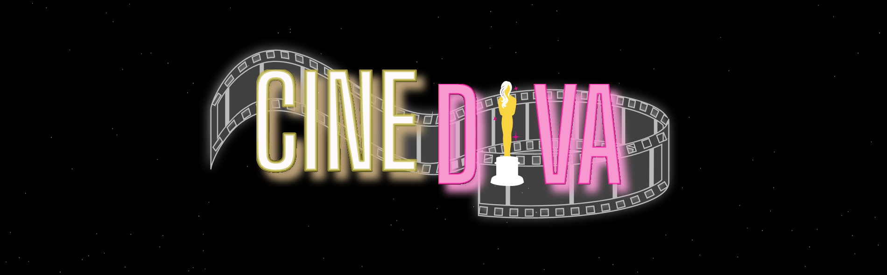
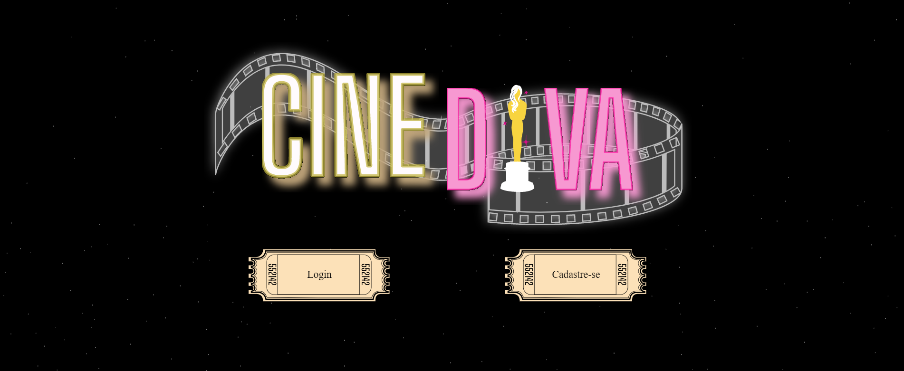
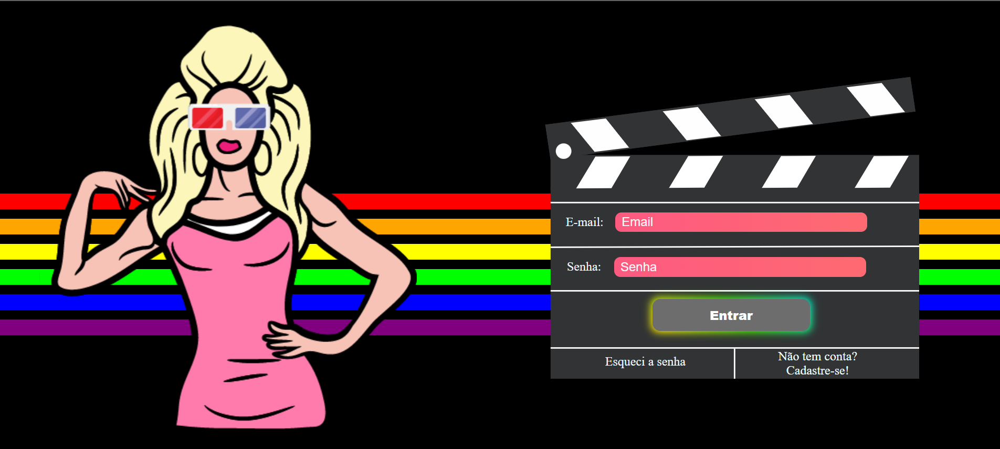
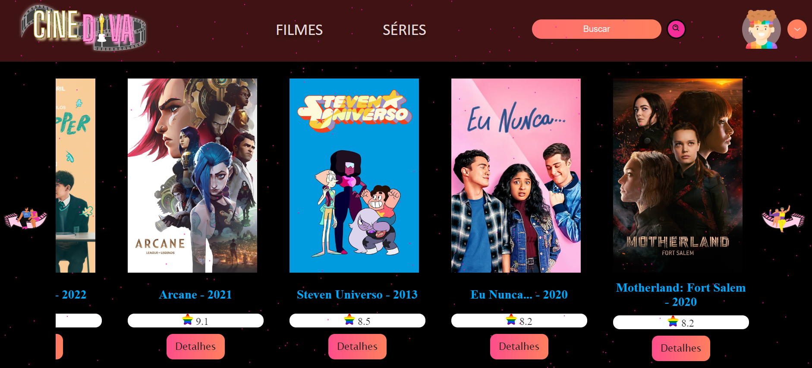
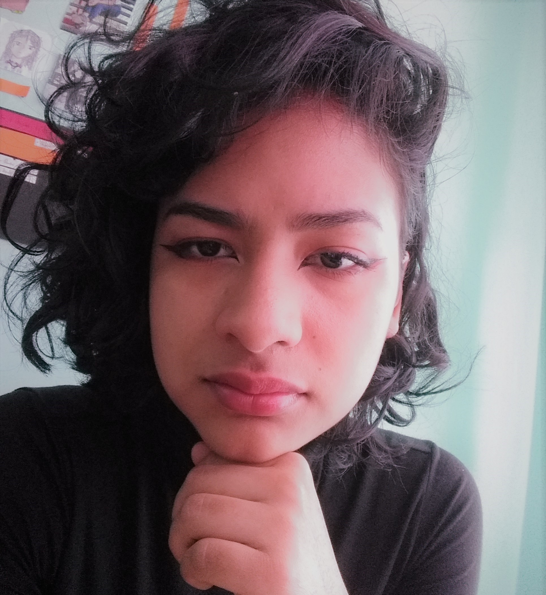
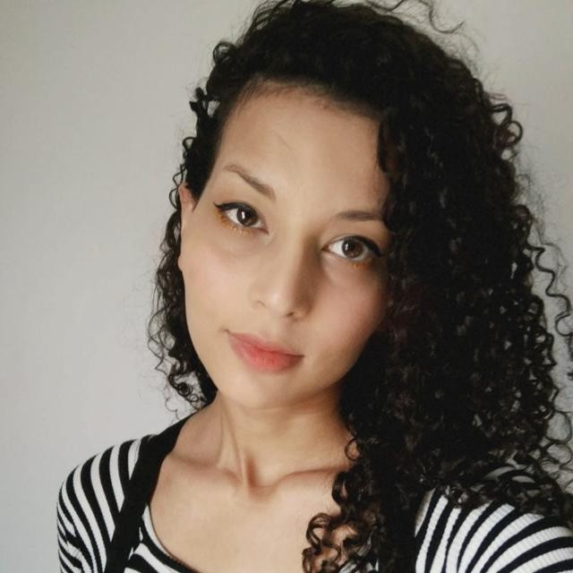

<h1 align='center'>🌈 CINEDIVA 🌈</h1>

<h4 align='center' >Encontre as melhores histórias</h4>

<br>



<br>
<br>

🏳️‍🌈 Tabela de conteúdos
=================
<!--ts-->
   * [Objetivo](#Objetivos)
   * [Clonagem](#Instalação)
   * [Demostração](#Demostração)
   * [Tecnologias](#Tecnologias)
   * [Autores](#Tecnologias)
<!--te-->

<br>

🔖 Objetivo
=================

<p>Este projeto teve como objetivo desenvolver um site responsivo com React que utilizasse os conhecimentos adquiridos nas aulas do módulo quatro da Resilia Educação. Utilizando os endpoints da Api CineDev desenvolvida no módulo passado que disponibiliza as funcionalidades do CRUD (Create-post, read-get, update-put, delete-delete)</p>

<br>

💻 Clonagem
=================

<p>Para utilizar o projeto:</p>

```bash
# Clone este repositório
$ git clone <https://github.com/Jessicacintra-eng/CineDev.git>

# Acesse a pasta do projeto no terminal
$ cd ./CineDev

# Instale as dependências
$ npm install

# Execute a aplicação em modo de desenvolvimento
$ npm run dev

```

<br>

💻 Demostração
=================

    🔥 Loading page



    🔥 Login



    🔥 Séries




<br>

📌Tecnologias
=================

Ferramentas que foram utilizadas no projeto:

   * Front-end
        * ReactJS
        * Vite
    
   * Back-end
        * NodeJS
        * Api Rest (CRUD)

   * Deploy
        * Vercel

<br>

👥 Autores
=================

<table>

<br>

  <tr>
    <td align="center"><a href="https://rocketseat.com.br"><br /><sub><b>Jessica Cintra</b></sub></a><br /><a href="https://rocketseat.com.br/" title="Rocketseat">🏳️‍🌈</a></td>
    <td align="center"><a href="https://rocketseat.com.br"><br /><sub><b>Vinicius Mocelin</b></sub></a><br /><a href="https://rocketseat.com.br/" title="Rocketseat">🏳️‍🌈</a></td>
    <td align="center"><a href="https://rocketseat.com.br"><br /><sub><b>Danielys Davila</b></sub></a><br /><a href="https://rocketseat.com.br/" title="Rocketseat">🏳️‍🌈</a></td>
    <td align="center"><a href="https://rocketseat.com.br"><br /><sub><b>Thaysa Weber</b></sub></a><br /><a href="https://rocketseat.com.br/" title="Rocketseat">🏳️‍🌈</a></td>
    <td align="center"><a href="https://rocketseat.com.br"><br /><sub><b>Carol Vilarino</b></sub></a><br /><a href="https://rocketseat.com.br/" title="Rocketseat">🏳️‍🌈</a></td>
  </tr>
</table>


